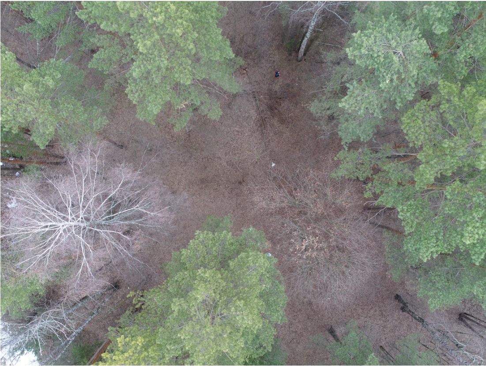
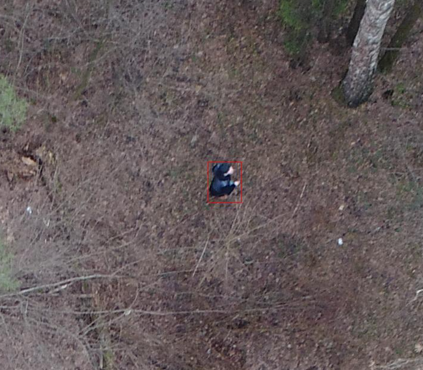
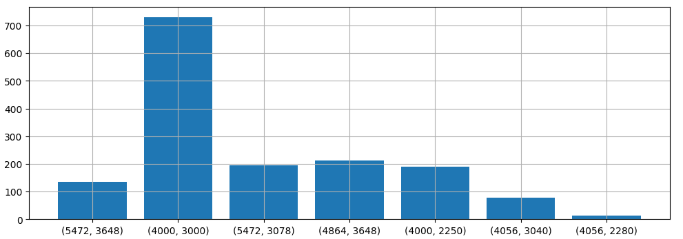
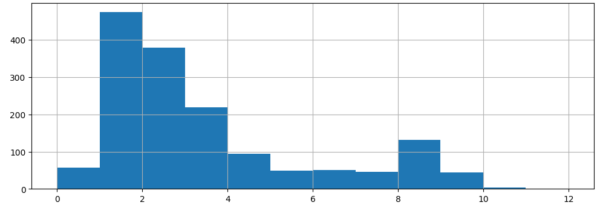

# Lacmus dataset: benchmark of crop predictions for tiny object detection in search and resque operations

## Abstract
We introduce an tiny object detection dataset named Lacmus, aiming at specific task - find missing people on the drone images. 
The images in the dataset were captured over grass and small trees areas of 5 different locations and 3 seasons. 
Lacmus dataset has more than 5000 annotated instances in 1552 images with annotations, including Pedestrian bounding boxes. 
For the real application, we are testing crop predictions and different input image sizes of yolo8. 
We found, that the best ratio of speed and accuracy has medium model size with large input size without cropping, just scaling input image.   
We hope the dataset boost both the research and development, that helps to save the lives of missing people.

# Introduction
Many people disappear in wilderness every year. 
A significant part of them are people who have lost their way far from human habitation. 
Fortunately, some of the lost are chosen by themselves, and volunteer search and rescue teams are mobilized to help others. 
The main search methods today, are on foot combing the surroundings using technical means, which are often no more complicated than a siren or a buzzing beacon. 
The topic is relevant and hot, generates many ideas for using in search of achievements of scientific and technological progress.  
Some of them are even embodied in the form of prototypes and tested at specially organized competitions. 
But in a forest the real conditions of the search coupled with limited material resources, make this problem difficult and still very far from a complete solution. 
In recent years, rescuers have increasingly used unmanned aerial vehicles (UAVs) to inspect large areas of the territory, photographing the area from a height of 40-50 m. 
From one search and rescue operation, several thousand photos are obtained, which today the volunteers look at manually. 
It is clear that such processing is long and inefficient. 
After two hours of such work, the volunteers get tired and cannot continue the search, but people's health and lives depend on its speed. 
Together with search and rescue teams, we are developing an application to search for missing people in images taken from UAVs.  

## Related works

A well-known task in the field of computer vision is object detection. 
Object detection methods have been developed for more than 50 years [Herskovits 1970, Yakimovsky 1976]. 
Nowadays, various neural network architectures are used for image processing. 
Historically, it is considered to be two types of detectors - one stage and two stage. 
One-stage detectors are used more often today due to the good ratio of accuracy and speed [Carranza-García 2020]. 
Nowadays, computationally more complex architectures based on transformers are known [Shehzadi 2023]. 
But heavy computing makes it difficult to use such architectures in real-world applications.  

Another very effective technique for improving prediction accuracy is the Slicing Aided Hyper Inference (SAHI) window method [Akyon 2022]. 
However, to pay for increased accuracy is increased computational costs, especially for processing high-resolution images. 
An adaptive method is also known to reduce unnecessary calculations [Zhang 2023].  
However, the question of choosing the optimal window size and model for detection is still open.  

The most popular benchmarks for comparing different object detection architectures are COCO [Lin 2014] and Pascal Voc [Everingham 2010].  
These datasets have a large number of marked-up images, unfortunately, not relevant to our special task. 
The VisDrone dataset [Zhu, 2018] is currently widely used for evaluating unmanned aerial vehicle (UAV) object detection. 
It was curated and created by the Machine Learning and Data Mining Laboratory team at Tianjin University. 
The dataset comprises 10,209 images, with 6471 images allocated for training, 548 images for validation, and 3190 images for testing. 
It encompasses a total of 10 object categories, namely, pedestrian, people, bicycle, car, van, truck, tricycle, awning-tricycle, bus, and motorbike. 
Most images made in city landscape, but this is not relevant context for the forest rescue operations. 
UAVDT [Du, 2018] is a dataset for single-object tracking and multi-object tracking tasks, with a resolution of 1024 × 540 pixels and a total of 80,000 frames from 100 videos. 
Each frame is annotated with three object classes: cars, buses, and trucks. Due to the specific nature of the original annotations. 
Only frames from the multi-object tracking task were used for object detection.
SeaDronesSee [Varga 2022] is a large-scale dataset aimed at helping develop systems for Search and Rescue (SAR) using Unmanned Aerial Vehicles (UAVs) in maritime scenarios. 
Building highly complex autonomous UAV systems that aid in SAR missions requires robust computer vision algorithms to detect and track objects or persons of interest. 
This data set provides three sets of tracks: object detection, single-object tracking and multi-object tracking. 
Each track consists of its own data set and leaderboard. Object Detection part contains 5,630 train images, 859 validation images, 1,796 testing images.
A special database called HERIDAL [Božić-Štulić 2019.] was compiled for SAR purposes. 
It contains over 68,750 image patches of wilderness acquired from an aerial perspective as well as approximately 500 labelled full-size real-world images intended for testing purposes. 
HERIDAL database  used to train and test a state-of-the-art region proposal network, Faster R-CNN and original proposed method.
This bencmark achieved a detection rate of 88.9% and a precision of 34.8%.
SARD [Sasa 2024] comprises 1,981 manually labeled images extracted from video frames of persons simulating search and rescue situations in roads, quarries, grass land, and forested areas, under diverse weather conditions. 
However, dataset lack rich generalization characteristics and environmental diversity. 
The  WiSARD dataset [Broyles 2022], comprises the richest set of images associated with wilderness SAR scenarios. 
It has 33,786 labeled RGB images, 22,156 labeled thermal images, and a subset consisting of 15,453 temporally synchronized visual-thermal image pairs. 
In addition to the useful multimodal imagery, the dataset includes environmental diversity across seasons and times of the day and night. 
WiSARD represents the richest dataset for blind search in wilderness scenarios, that is, search for any person on an area rather than the search for an specific person; 
Special aerial datasets have been created to apply in Emergency Response Scenarios. 
Natural Occluded Multiscale Aerial Dataset (NOMAD) [Russel Bernal 2024] presents a benchmark for human detection under occluded aerial views, with five different aerial distances and rich imagery variance. 
NOMAD is composed of 100 different Actors, all performing sequences of walking, laying and hiding. 
It includes 42,825 frames, extracted from 5.4k resolution videos, and manually annotated with a bounding box and a label describing 10 different visibility levels, categorized according to the percentage of the human body visible inside the bounding box. 
This allows computer vision models to be evaluated on their detection performance across different ranges of occlusion. 
NOMAD is designed to improve the effectiveness of aerial search and rescue and to enhance collaboration between sUAS and humans, by providing a new benchmark dataset for human detection under occluded aerial views.

In SAR operations, the objects detecting task has the following features [Du 2018]: 
- **Objects are only one class**. 
As a rule, people are of the greatest interest in the search. 
Other classes of objects may also be present, but their detection is rather an exception to the rule. 
- **High resolution images**. 
At high altitude, the number of pixels plays a very important role. 
The higher the resolution of the image, the more pixels there will be per object. 
A good number can be considered 100 by 100 pixels. In this case, the image of the object contains enough information to detect it. 
- **Small size of objects.** 
The higher the flight altitude, the smaller the area a person will occupy in the picture. 
Even in the best case, the area of a person occupies less than 1% of the total area of the image. 
- **Camera movement**. 
The higher the speed of the UAV, the more blurred the image becomes. 
In this case, you have to sacrifice shutter speed, which also reduces the quality of the photo. 
In addition, the constantly changing camera position gives different camera angles for a single object. 
This means that the detection model must have a sufficiently high generalizing ability. 
- **Limited time for prediction**. 
A large amount of information requires a lot of processing costs. 
Powerful computers with modern video cards are not always available to rescue teams.  

Therefore, the more effectively the detection algorithm works, the less time it will take to find a missing person and rescue him. 
The Lacmus Foundation team is developing applications for rescue teams that work on stationary and mobile platforms. 
The aim of our research is to find the best balance between speed and accuracy of prediction. 
This issue is very important, because our applications are already successfully used in real rescue operations. 

## Dataset description 

Training search and rescue operations were conducted to collect data. 
A team of volunteers traveled to the area and were there in various poses. 
These poses corresponded to how the real missing people were found. 
We used clothes of different colors, as well as terrain with different numbers of trees: 
- a clear field;
- a rare forest;
- a sparse forest.

In total, 5 training sessions were conducted at 3 different seasons: spring, summer and winter. 

Dataset has 1552 images with more than 5000 annotated objects.  
Image with object example is on the picture. 

Most of the images have resolution (4000,3000) and more. 
Some have less height about 2250 or 2280 px.
Image size distribution is on the picture. 

Most images have from 2 to 4 boxes. 
But some images has about 100 objects, and 57 only background. 
Box numbers distribution is on the picture. 

# Methods 

## Data collection 

There are five folds of images collected from different areas and seasons:
- 0 : 410 winter Moscow 2019;
- 411 : 768 summer Moscow 2019;
- 769 : 1036 spring Korolev 2019;
- 1037 : 1421 summer Tambov 2019;
- 1422 : 1551 summer Nnovgorod 2021. 

To avoid data liks, data from the four SARs 0 - 1421 used as a train subset. 
Images from Nnovgorod SAR 1422 - 1551 used as a test subset. 

## Training models

We use precision and recall as performance metrics. 
Precision reflects the magnitude of errors of the 1 type errors, or the proportion of objects mistaken for a person. 
Recall reflects the magnitude of errors of the second kind, or the proportion of objects (people) that the algorithm could not detect. 
We believe that Recall metric has a greater practical importance. 
As speed metric, we use the prediction time on the CPU and GPU in milliseconds. 
Thanks to the creators of the ultralitics framework for implementing the functionality for measuring the performance of models.

Yolov8 [Redmon 2016] pretrained with COCO was used as models for our experiments. 
We used three main models with different number of parameters: 
- yolo v8 nano - 3.2 M parameters
- yolo v8 medium - 25.9M parameters
- yolo v8 xlarge - 68.2M parameters

For each of the three models, we use three input image sizes: 640, 1280 and 1984 pixels. 

In addition, we use three schemes to assess the impact of sliding window sizes:
- no crops, the original image scales to the input size of the model;
- splitting the original image into two parts (2 x 1) and scale each crop to the input size of the model;
- splitting the original image into six parts (3 x 2) and scale each crop to the input size of the model.  

# Results

A computer with the following characteristics was used for experiments:
- CPU Ryzen 5 2700 RAM 32 GB;
- GPU RTX3090 RAM 24 GB.
- Ubuntu 24.04, python 3.9, ultralitics 8.2.28.

Results are in the tables 1 - 3.  

Yolo 8n Precision / Recall, %

| input size | No crops | Crops 2 x 1 | Crops 3 x 2 | CPU infer, ms | GPU infer, ms | 
|------------|----------|-------------|-------------|---------------|---------------|
| 640        | 20 / 23  | 30 / 28     | 26 / 40     |               |               |   
| 1280       | 29 / 27  |             |             |               |               |   
| 1984       | 36 / 35  | 37 / 41     | 45 / 49     |               |               |   

Yolo 8m  Precision / Recall, % 

| input size | No crops | Crops 2 x 1 | Crops 3 x 2 | CPU infer,  ms | GPU infer,  ms | 
|------------|----------|-------------|-------------|----------------|----------------|
| 640        | 27 / 28  | 30 / 32     | 41 / 42     |                |                |   
| 1280       |          |             | 46 / 50     |                |                |   
| 1984       | 40 / 41  | 45 / 42     |             |                |                |   

Yolo 8x  Precision / Recall, % 

| input size | No crops | Crops 2 x 1 | Crops 3 x 2 | CPU infer,  ms | GPU infer,  ms | 
|------------|----------|-------------|-------------|----------------|----------------|
| 640        | 24 / 24  |             | 34 / 40     |                |                |   
| 1280       | 33 / 29  |             |             |                |                |   
| 1984       | 35 / 42  | 37 / 41     | 45 / 47     |                |                |   

# Discussion 

The most accurate model is -  
The fastest model is  
When processing images on the GPU, it will be most effective to use image patches to maximize GPU memory usage.  
For these purposes, the most preferred scheme is -  
When working on the CPU, the most preferred scheme is -  
Thus, in real applications, it is necessary to take into account which processor will be used by the user.  
Based on this, the best model with the best number of sliding windows should be used. 

# References

- Zhu, P., Wen, L., Du, D., Bian, X., Ling, H., Hu, Q., Nie, Q., Cheng, H., Liu, C., Liu, X. and Ma, W., 2018. Visdrone-det2018: The vision meets drone object detection in image challenge results. In Proceedings of the European Conference on Computer Vision (ECCV) Workshops (pp. 0-0).
- Du, D., Qi, Y., Yu, H., Yang, Y., Duan, K., Li, G., Zhang, W., Huang, Q. and Tian, Q., 2018. The unmanned aerial vehicle benchmark: Object detection and tracking. In Proceedings of the European conference on computer vision (ECCV) (pp. 370-386).
- Varga, L.A., Kiefer, B., Messmer, M. and Zell, A., 2022. Seadronessee: A maritime benchmark for detecting humans in open water. In Proceedings of the IEEE/CVF winter conference on applications of computer vision (pp. 2260-2270).
- Sambolek, S. and Ivasic-Kos, M., 2024. Person Detection and Geolocation Estimation in UAV Aerial Images: An Experimental Approach. In ICPRAM (pp. 785-792).
- Božić-Štulić, D., Marušić, Ž. and Gotovac, S., 2019. Deep learning approach in aerial imagery for supporting land search and rescue missions. International Journal of Computer Vision, 127(9), pp.1256-1278.
- Russell Bernal, A.M., Scheirer, W. and Cleland-Huang, J., 2024. NOMAD: A Natural, Occluded, Multi-scale Aerial Dataset, for Emergency Response Scenarios. In Proceedings of the IEEE/CVF Winter Conference on Applications of Computer Vision (pp. 8584-8595).
- Broyles, D., Hayner, C.R. and Leung, K., 2022, October. Wisard: A labeled visual and thermal image dataset for wilderness search and rescue. In 2022 IEEE/RSJ International Conference on Intelligent Robots and Systems (IROS) (pp. 9467-9474). IEEE.
- Zou, Z., Chen, K., Shi, Z., Guo, Y. and Ye, J., 2023. Object detection in 20 years: A survey. Proceedings of the IEEE, 111(3), pp.257-276.  
- Yakimovsky, Y., 1976. Boundary and object detection in real world images. Journal of the ACM (JACM), 23(4), pp.599-618.  
- Herskovits, A. and Binford, T.O., 1970. On boundary detection.  
- Amjoud, A.B. and Amrouch, M., 2023. Object detection using deep learning, CNNs and vision transformers: A review. IEEE Access, 11, pp.35479-35516.  
- Shehzadi, T., Hashmi, K.A., Stricker, D. and Afzal, M.Z., 2023. 2d object detection with transformers: a review. arXiv preprint arXiv:2306.04670.
- Lin, T.Y., Maire, M., Belongie, S., Hays, J., Perona, P., Ramanan, D., Dollár, P. and Zitnick, C.L., 2014. Microsoft coco: Common objects in context. In Computer Vision–ECCV 2014: 13th European Conference, Zurich, Switzerland, September 6-12, 2014, Proceedings, Part V 13 (pp. 740-755). Springer International Publishing.  
- Everingham, M., Van Gool, L., Williams, C.K., Winn, J. and Zisserman, A., 2010. The pascal visual object classes (voc) challenge. International journal of computer vision, 88, pp.303-338. 
- Akyon, F.C., Altinuc, S.O. and Temizel, A., 2022, October. Slicing aided hyper inference and fine-tuning for small object detection. In 2022 IEEE International Conference on Image Processing (ICIP) (pp. 966-970). IEEE.
- Zhang, H., Hao, C., Song, W., Jiang, B. and Li, B., 2023. Adaptive slicing-aided hyper inference for small object detection in high-resolution remote sensing images. Remote Sensing, 15(5), p.1249.
- Carranza-García, M., Torres-Mateo, J., Lara-Benítez, P. and García-Gutiérrez, J., 2020. On the performance of one-stage and two-stage object detectors in autonomous vehicles using camera data. Remote Sensing, 13(1), p.89.
- Redmon, J., 2016. You only look once: Unified, real-time object detection. In Proceedings of the IEEE conference on computer vision and pattern recognition. 
