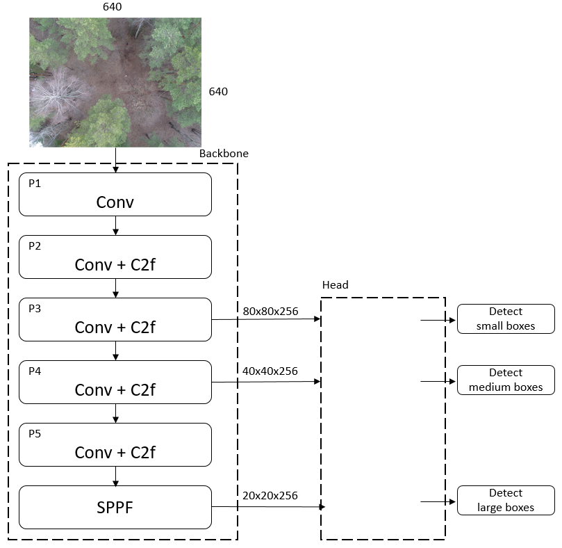

Аннотация 

# Введение

Известная задача в области компьютерного зрения - детекция объектов. 
Методы детекции объектов разрабатываются уже более 50 лет [Herskovits 1970, Yakimovsky 1976]. 
В наши дни для обработки изображений используются различные архитектуры нейросетей. 
Исторически принято выделять два вида детекторов - одного уровня и двух уровневые. 
Детекторы one-stage сегодня применяются чаще из-за хорошего соотношения точности и скорости [Carranza-García 2020]. 
Кроме того, известны вычислительно более сложные архитектуры на базе трансформеров [Shehzadi 2023]. 
Очень эффективной техникой повышения точности предсказания является метод скользящего окна SAHI [Akyon 2022]. 
Однако расплатой за повышение точности является повышение вычислительных затрат, особенно на обработку изображений высокого разрешеня. 
Известен также адаптивный метод для сокращения ненужных вычислений [Zhang 2023]. 
Однако вопрос о выборе оптимального размера окна и модели для детекции остается открытым.  

Командой Lacmus Foundation разрабатываются приложения для спасательных отрядов, которые работают на стационарных и мобильных платформах. 
Целью нашего исследования является поиск лучшего баланса между скоростью и точностью предсказания. 
Этот вопрос имеет большое значение, т.к. наши приложения уже успешно используются в реальных спасательных операциях.  

Наиболее популярными бенчмарками для сравнения различных архитектур детекции объектов являются COCO [Lin 2014] и Pascal Voc [Everingham 2010].     
Эти датасеты имеют большое количество размеченных изображений, к сожалению, не релевантных нашей специальной задаче.  

В спасательных операциях задача детекции объектов имеет следующие особенности [Du 2018]: 
- Объекты одного класса. Как правило, наибольший интерес в поиске представляют люди. Остальные классы объектов тоже могут присутствовать, но их обнаружение является скорее исключением из правил. 
- Высокое разрешение снимков. На большой высоте количество пикселей играет очень важную роль. Чем выше разрешение снимка, тем больше пикселей будет приходиться на один объект. Хорошим числом можно считать 100 на 100 пикселей. В этом случае изображение объекта содержит достаточное количество информации для его детектирования.  
- Малый размер объектов. Чем выше высота полета, тем меньшую площадь человек будет занимать на снимке. Даже в лучшем случае, площадь человека занимает менее 1% от общей площади изображения.     
- Движение камеры. Чем выше скорость движения БпЛА, тем более смазанным получается изображение. В этом случае приходится жертвовать выдержкой, что тоже снижает качество фотографии. Кроме того, постоянно меняющееся положение камеры дает разные ракурсы для одного объекта. Это значит, что модель детекции должна иметь достаточно высокую обобщающую способность. 
- Ограниченное время для обработки снимков. Большое количество информации требует больших затрат для обработки. Мощные компьютеры с современными видеокартами не всегда доступны отрядам спасателей. Поэтому чем эффективнее будет работать алгоритм детекции, тем меньше времени понадобится для обнаружения пропавшего человека и его спасения.  

# Методы исследования

Для сбора данных проводились учебные поисково-спасательные операции. 
Команда добровольцев выезжала на местность и находилась там в различных позах. 
Эти позы соответствовали тому, как были найдены рельно пропавшие люди. 
Мы использовали одежду разных цветов, а также местность с различным количеством деревьев: 
- чистое поле;
- не густой лес.

Всего было проведено 5 учебных съемок в разное время года: весна, лето и зима. 
для исследования соотношения скорости и точности мы создали дополнительно два датасета путем разделения исходных изображений на несколько частей: 
Crop 2x1 - разделение на 2 части по ширине. Это дало нам 2844 изображения для обучения и 260 для тестирования. 
Crop 3x2 - разделение на 6 частей - 3 по ширине и 2 по высоте. Это дало нам 5688 изображений для обучения и 520 для тестирования. 
Таким образом, в нашем распоряжении имеется три разных варианта одинаковых данных. 
Это нужно для того, чтобы оценить потерю точности детекции при разных уровнях сжатия разрешения изображений. 
Максимальное сжатие будет в том случае, когда исходное изображение будет сжиматься до размера модели 640 на 640. 
Минимальные потери от сжатия будут в датасете 3x2 и входном размере модели 1984 на 1984.  

В качестве метрик точности мы используем precision and recall. 
Precision отражает величину ошибок первого рода, или долю объектов, ошибочно принятых за человека. 
Recall отражает величину ошибок второго рода, или долю объектов (людей), которые алгоритм не смог обнаружить. 
Мы считаем, что Recall имеем большее практическое значение. 
В качестве метрик скорости мы используем время предсказания на CPU и GPU в милисекундах. 
Спасибо создателям фреймворка ultralitics за то, что реализовали функционал для замера производительности моделей. 

В качестве моделей для наших экспериментов использовалась yolov8. 
Архитектура приведена на рисунке 

Основными особенностями yolo8 являются: 
- SPPF
- C2F
- SPF 

Мы использовали три основных модели с различным количеством сверточных слоев и максимальным количеством сверточных фильтров: 
- yolo v8 nano - 225 слоев, 1024 фильтров,  3.2 M параметров
- yolo v8 medium - 295 слоев, 768 фильтров, 25.9 M параметров
- yolo v8 xlarge - 365 слоев, 512 фильтров, 68.2 M параметров

Для каждой из трех моделей мы используем различные размеры входного изображения. 
Этот параметр ImgSize влияет на количество боксов на выходе модели в соответствии с формулой: 
$$NumBoxes = 63/1024*(ImgSize)^2$$
- 640 px - , 1280 и 1984 пикселя. 

Кроме того, для оценки влияния размеров скользящего окна мы используем три схемы:
- обычное сжатие исходного изображения до входного размера модели;
- разделение исходного изображение на две части и сжатие каждого кропа до входного размера модели;
- разделение исходного изображение на шесть частей и сжатие каждого кропа до входного размера модели. 

# Результаты

Для экспериментов использовалась машина со следующими характеристиками:
- CPU Ryzen 5 2700 RAM 32 GB;
- GPU RTX3090 RAM 24 GB.
- Ubuntu 24.04, python 3.9, ultralitics 8.2.28.

# Обсуждение

Самой точной моделью является - 
Самой быстрой моделью является 
При обработке изображений на GPU наиболее эффективно будет использовать батчи изображений для максимальной загрузки памяти GPU. 
Для этих целей наиболее предпочтительна схема - 
При работе на CPU наиболее предпочтительна схема - 
Таким образом, в реальных приложениях нужно учитывать какой процессор будет использован пользователем. 
Исходя из этого следует задействовать лучшую модель с лучшим количеством скользящих окон. 

# Ссылки

