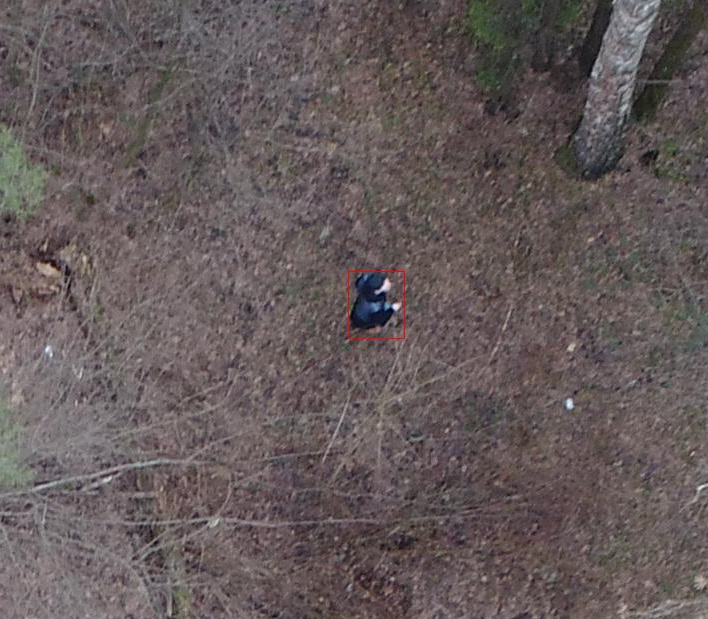
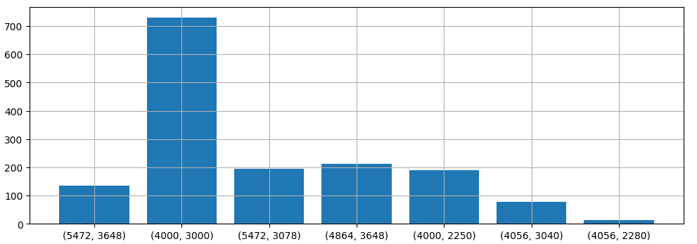
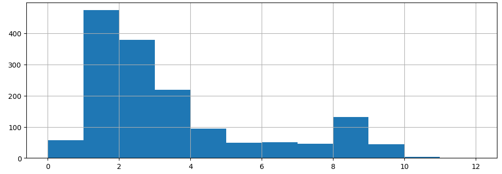

# Исследование соотношение точности и производительности моделей yolo8 на специальном наборе данных 

## Аннотация 
В статье представлен набор данных  под названием Lacmus. 
Датасет предназначен для решения задачи детекции объектов - поиска пропавших людей на снимках, сделанных с помощью беспилотника. 
Набор данных Lacmus содержит более 5000 размеченных боксов на 1552 изображениях, сделанных  в 5 разных локациях в траве или редком лесу, в разные времена года. 
Данные были собраны для обучения нейросети и дальнейшего использования в реальном приложении поисково спасательных отрядов. 
Целью исследования является поиск оптимального соотношения точности и производительности моделей yolo 8 на имеющихся данных. 
Мы обнаружили, что наилучшее соотношение дает модель среднего размера с большим размером входных изображений без нарезки на части. 
Мы надеемся, что собранные данные и проведенное исследование поможет спасти жизни пропавших без вести людей. 

## Введение
Каждый год на местности пропадает множество людей. 
Значительная часть из них - это люди, которые заблудились вдали от человеческого жилья. 
К счастью, некоторые из заблудившихся выбираются сами, но для тех кто не смог, проводятся поисково-спасательные операции (ПСО). 
Тема актуальная, множество идей уже реализованы в виде прототипов и апробированы на специально организованных конкурсах. 
Но в лесу реальные условия поиска в сочетании с ограниченными материальными ресурсами делают эту проблему сложной и все еще очень далекой от успешного решения.  

В последние годы спасатели все чаще используют беспилотные летательные аппараты (БПЛА) для обследования больших участков территории, фотографируя местность с высоты 40-50 м. 
В результате одной поисково-спасательной операции получается несколько тысяч фотографий, которые сегодня волонтеры просматривают вручную. 
Такая обработка является длительной, после двух часов непрерывной работы волонтеры устают и не могут эффективно продолжать поиски. 
Однако от скорости и точности обработки снимков зависят здоровье и жизни людей. 
Фонд Lacmus совместно с поисково-спасательными командами разрабатывает приложение для поиска пропавших людей по снимкам, сделанным с БПЛА. 

## Обзор проведенных исследований 
Известная задача в области компьютерного зрения - детекция объектов. 
Методы детекции объектов разрабатываются уже более 50 лет [Herskovits 1970, Yakimovsky 1976]. 
В наши дни для обработки изображений используются различные архитектуры нейросетей. 
Исторически принято выделять два вида детекторов - одного уровня и двух уровневые. 
Детекторы one-stage сегодня применяются чаще из-за хорошего соотношения точности и скорости [Carranza-García 2020]. 
Кроме того, известны вычислительно более сложные архитектуры на базе трансформеров [Shehzadi 2023]. 
Однако расплатой за повышение точности является повышение вычислительных затрат, особенно на обработку изображений высокого разрешеня. 

Наиболее популярными бенчмарками для сравнения различных архитектур детекции объектов являются COCO [Lin 2014] и Pascal Voc [Everingham 2010].     
Эти датасеты имеют большое количество размеченных изображений, к сожалению, не релевантных нашей специальной задаче.  
Набор данных VisDrone [Zhu, 2018] в настоящее время широко используется для оценки обнаружения объектов беспилотными летательными аппаратами (БПЛА). 
Набор данных содержит 10 209 изображений, из которых 6471 изображение предназначено для обучения, 548 изображений - для валидации и 3190 изображений - для тестирования. 
Он охватывает 10 категорий объектов: люди и различные виды техники: велосипеды, автомобили, грузовики и т.д.. 
Большинство снимков сделано в городском контексте, что затрудняет применение этих снимков для обучений нейросетей для спасательных операций в лесу. 
Набор данных UAVDT [Du, 2018] собран для задач отслеживания объектов, содержит изображения разрешением 1024 × 540 пикселей и общим количеством 80 000 кадров из 100 видеороликов. 
Каждый кадр содержит три класса объектов: автомобили, автобусы и грузовики. 
Датасет также имеет специфику для решения задачи объектов в городской среде и не подходит для детекции людей в лесу. Набор данных SeaDronesSee [Varga 2022]  предназначен для разработки систем поиска и спасания (SAR) с использованием беспилотных летательных аппаратов (БПЛА) в морских условиях. 
Этот набор данных позволяет тренировать нейросети для решения трех задач: детекция объектов, отслеживание отдельных объектов и отслеживание нескольких объектов. 
Для детекции объектов доступно 5630 изображений в обучающей выборки, 859 изображений для проверки и 1796 изображений для тестирования. 
Специфику лесных ПСО хорошо отражает специальная база данных под названием HERIDAL [Božić-Štulić, 2019]. 
Он содержит более 68 750 изображений в природном ландшафте, полученных с высоты птичьего полета, а также 500 размеченных полноразмерных изображений, предназначенных для тестирования. 
База данных HERIDAL использовалась для обучения и тестирования различных архитектур, включая оригинальную нейросеть, предложенную авторами.
В этом исследовании полнота обнаружения составила 88,9%, а точность - 34,8%.
Датасет SARD [Sasa 2024] содержит 1981 размеченных изображение, извлеченное из видеокадров, на которых люди имитируют поисково-спасательные операции на дорогах, в карьерах, на лугах и в лесных массивах в различных погодных условиях. 
Набор данных WiSARD [Broyles, 2022] содержит самый богатый набор изображений, связанных со сценариями SAR в дикой природе. 
Он содержит 33 786 изображений с маркировкой RGB, 22 156 тепловых изображений с маркировкой и подмножество, состоящее из 15 453 синхронизированных во времени пар визуальных и тепловых изображений. 
В дополнение к полезным мультимодальным изображениям, набор данных включает в себя разнообразие окружающей среды в зависимости от сезона и времени дня и ночи. 
Также известен набор данных NOMAD, в котором собраны снимки с различной степенью затененности объектов и высоты полета БПЛА [Russel Bernal, 2024] 
При создании датасета 100 различных актеров исполняли различные сценарии хождения, лежания и прятания. 
Набор включает в себя 42 825 кадров, извлеченных из видео с разрешением более 5000 пикселей.
Аннотации включают в себя боксы объектов и описание уровня видимости, в соответствии с процентной долей человеческого тела, видимой внутри рамки. 
Такая разметка позволяет оценивать эффективность обнаружения с помощью моделей компьютерного зрения при различных уровнях видимости объекта. 
NOMAD разработан для повышения эффективности ПСО, однако отсутствует в свободном доступе.

Таким образом, проанализировав различные наборы данных, можно выделить следующие особенности задачи детекции объектов в спасательных операциях [Du 2018]: 
- Объекты одного класса. Как правило, наибольший интерес в поиске представляют люди. Остальные классы объектов тоже могут присутствовать, но их обнаружение является скорее исключением из правил. 
- Высокое разрешение снимков. На большой высоте количество пикселей играет очень важную роль. Чем выше разрешение снимка, тем больше пикселей будет приходиться на один объект. Хорошим числом можно считать 100 на 100 пикселей. В этом случае изображение объекта содержит достаточное количество информации для его детектирования.  
- Малый размер объектов. Чем выше высота полета, тем меньшую площадь человек будет занимать на снимке. Даже в лучшем случае, площадь человека занимает менее 1% от общей площади изображения.     
- Движение камеры. Чем выше скорость движения БпЛА, тем более смазанным получается изображение. В этом случае приходится жертвовать выдержкой, что тоже снижает качество фотографии. Кроме того, постоянно меняющееся положение камеры дает разные ракурсы для одного объекта. Это значит, что модель детекции должна иметь достаточно высокую обобщающую способность. 
- Ограниченное время для обработки снимков. Большое количество информации требует больших затрат для обработки. Мощные компьютеры с современными видеокартами не всегда доступны отрядам спасателей. Поэтому чем эффективнее будет работать алгоритм детекции, тем меньше времени понадобится для обнаружения пропавшего человека и его спасения.  

Актуальной темой является повышение точности детекции объектов малой площади.  
Очень эффективным методом для решения этой задачи является метод окна Slicing Aided HyperInference (SAHI) [Akyon 2022]. 
И снова, за повышение точности приходится расплачиваться увеличением вычислительных затрат, особенно при обработке изображений с высоким разрешением.
Известны работы по поиску лучшего соотношения скорости и точности, например адаптивный метод для сокращения ненужных вычислений [Zhang 2023]. 
Однако вопрос о выборе оптимального размера окна и входа модели one-stage детектора остается открытым.  

Команда Lacmus Foundation разрабатывает приложения для спасательных отрядов, которые работают на стационарных и мобильных платформах. 
Целью нашего исследования является поиск лучшего баланса между скоростью и точностью предсказания. 
Этот вопрос имеет большое значение, т.к. наши приложения уже успешно используются в реальных ПСО.  

## Методы исследования

### Описание данных

Для сбора данных проводились учебные ПСО, команда добровольцев выезжала на местность и находилась там в различных позах. 
Эти позы соответствовали тому, как были найдены рельно пропавшие люди. 

Добровольцы использовали одежду разных цветов, а также местность с различным количеством деревьев: 
- чистое поле;
- не густой лес. 
Съемка велась с помощью различных БПЛА коптерного типа с высоты 40-50 м. 
Всего было произведено 5 учебных ПСО в разные времена года и в разной местности:
- 0 : 410 зима Moscow 2019;
- 411 : 768 лето Moscow 2019;
- 769 : 1036 весна Korolev 2019;
- 1037 : 1421 лето Tambov 2019;
- 1422 : 1551 лето Nnovgorod 2021.

Итого было отснято и размечено 1552 изображений с более 5000 объектами. 
Пример изображения и человека на нем приведен на рисунке. 

Большинство изображений имеют разрешение 4000 на 3000 пикселей или больше. 
Небольшое количество изображений имеет небольшой размер 2250 пикселей. 
Гистограмма распределения размеров изображений представлена на рисунке. 

Большинство изображений содержат от 2 до 4 объектов, некоторые до 100. 
Кроме того, изначально в датасет включены 57 изображений без людей, только фотография местности. 
Гистограмма распределения количества боксов приведена на рисунке. 

!todo: гистограмма площади объектов.  

В качестве обучающей выборки мы использовали данные из первых четырех ПСО (0-1421), для тестирования - данные с пятой ПСО (1422-1551). 
Такая схема разделения позволяет избежать утечки данных и соответствует реальному сценарию применения нейросети. 

Для оценки влияния площади объекта на соотношения скорости и точности детекции мы создали два дополнительных датасета путем разделения исходных изображений на несколько частей: 
- 2x1 - разделение на 2 части по ширине. Это дало нам 1804 изображения для обучения и 147 для тестирования. 
- 3x2 - разделение на 6 частей - 3 по ширине и 2 по высоте. Это дало нам 2368 изображений для обучения и 192 для тестирования.
- 1x1 - без разделения на части, 1422 изображения для обучения и 130 для тестирования.

Те кропы, на которых не было людей, мы просто отбрасывали. 
Схема разделения представлена на рисунке. 

 

Таким образом, в нашем распоряжении имеется три разных варианта одинаковых данных, с разным соотношением площади объектов к площади изображения (1:1200, 1:600 и 1:200).  
Такой прием позволяет оценить точность детекции объектов при разных уровнях масштабирования. 
Максимальное сжатие будет в том случае, когда исходное изображение будет сжиматься до размера модели 640 на 640. 
Минимальные потери от сжатия, а в некоторых случаях даже повышение разрешения исходных изображений будет в датасете 3x2 и входном размере модели 1984 на 1984.  

### Методика обучения моделей

Бокс считается объектом, если вероятность классификации выше заданного порога. 
Объект считается верно найденным, если величина IoU превышает заданный порог. 

$$
\displaystyle IoU = \frac{B_t \cap B_p}{B_t \cup B_p}
$$

В качестве метрик точности мы используем precision and recall. 
Precision отражает величину ошибок первого рода, или долю объектов, ошибочно принятых за человека. 

$$
\displaystyle Precision = \frac{TP}{TP + FP}
$$

Recall отражает величину ошибок второго рода, или долю объектов (людей), которые алгоритм не смог обнаружить. 

$$
\displaystyle Recall = \frac{TP}{TP + FN}
$$

Мы считаем, что в задаче поиска пропавших людей Recall имеет большее значение. 
Оператор может увидеть большое количество ложных срабатываний детектора и просто пропустить их. 
Однако если детектор пропустит человека, оператор тоже скорее всего его не увидит. 

В качестве метрик скорости мы используем время предсказания на CPU и GPU в милисекундах. 
Спасибо создателям фреймворка ultralitics за то, что реализовали функционал для замера производительности моделей. 

В качестве моделей для наших экспериментов использовалась yolov8. 
Упрощенная архитектура нейросети приведена на рисунке. 

Основными особенностями yolo8 являются: 
- SPPF - Spatial Pyramid Pooling Fast, быстрая версия пирамиды пулингов. 
- C2F - Cross stage partial слой с двумя свертками, тоже более быстрая версия. 

Мы использовали три основных модели с различным количеством сверточных слоев и максимальным количеством сверточных фильтров: 
- yolo v8 nano - 225 слоев, 1024 фильтров,  3.2 M параметров;
- yolo v8 medium - 295 слоев, 768 фильтров, 25.9 M параметров;
- yolo v8 xlarge - 365 слоев, 512 фильтров, 68.2 M параметров.

Для каждой из трех моделей мы используем различные размеры входного изображения. 
Чем больше размер входа ImgSize, тем больше вычислений нужно произвести и больше количество боксов на выходе модели 
Для представленной архитектуры yolo8 можно воспользоваться эмпирической формулой: 

$$
\displaystyle NumBoxes = \frac{21}{1024}\cdot{ImgSize}^2
$$

Таким образом, каждая из трех моделей используется с тремя разными размерами входных изображений: 
- на входе 640 px - на выходе 8400 боксов, 
- на входе 1280 px - на выходе 33600 боксов, 
- на входе 1984 px - на выходе 80724 боксов. 

Кроме того, для оценки влияния размеров скользящего окна мы используем три датасета с разным соотношением площади объектов и изображения:
- без нарезки - 1 : 1200;
- 2х1 - 1 : 600;
- 3х2 - 1 : 200.

## Результаты

Для экспериментов использовалась машина со следующими характеристиками:
- CPU Ryzen 5 2700 RAM 32 GB;
- GPU RTX3090 RAM 24 GB.
- Ubuntu 24.04, python 3.9, ultralitics 8.2.28.

Для инференса на GPU мы не использовали оптимизации, размер батча определялся автоматически для заполнения памяти на уровне 70%. 
Представленная задержка включает в себя затраты на непосредственно инференс и постобработку NMS [Hosang 2017]. 
Время предварительной обработки изображений не учитывалось. 
Для инференса на CPU модели были оптимизированы с помощью python модуля onnx с параметрами по умолчанию. 

Результаты исследования представлены в таблицах 1-3.

Yolo 8n Precision / Recall, %

| input size | No crops | Crops 2x1 | Crops 3x2 | CPU infer, ms | GPU infer, ms | 
|------------|----------|-----------|-----------|---------------|---------------|
| 640        | 20 / 23  | 30 / 28   | 26 / 40   | 68            | 10            |   
| 1280       | 29 / 27  | 34 / 40   | 43 / 42   | 250           | 13            |   
| 1984       | 36 / 35  | 37 / 41   | 45 / 49   | 700           | 20            |   

Yolo 8m  Precision / Recall, % 

| input size | No crops | Crops 2x1 | Crops 3x2 | CPU infer,  ms | GPU infer, ms | 
|------------|----------|-----------|-----------|----------------|---------------|
| 640        | 27 / 28  | 30 / 32   | 41 / 42   | 360            | 18            |   
| 1280       | 34 / 35  | 38 / 37   | 46 / 50   | 1500           | 23            |   
| 1984       | 40 / 41  | 45 / 42   | 50 / 50   | 3600           | 44            |   

Yolo 8x  Precision / Recall, % 

| input size | No crops | Crops 2x1 | Crops 3x2 | CPU infer, ms | GPU infer, ms | 
|------------|----------|-----------|-----------|---------------|---------------|
| 640        | 24 / 24  | 32 / 29   | 34 / 40   | 1050          | 21            |   
| 1280       | 33 / 29  | 35 / 35   | 44 / 38   | 4400          | 37            |   
| 1984       | 43 / 35  | 37 / 41   | 45 / 47   | 10800         | 93            |   

Сравнение динамики обобщенной функции потерь (dfl) [Li 2020] для моделей с размером входных изображений 1984 пикселей представлено на рисунке 7. 

 

Обобщенная функция потерь на обучающей и тестовой выборках для трех моделей yolo 8: a) nano, b) medium и c) xlarge.

## Обсуждение

Самой точной моделью является yolo8m с размером входного изображения 1984 пикселей. 
На датасете 3х2 точность и полнота достигают 50%, при этом затраты на инференс примерно в три раза меньше, чем для более тяжелой yolo8x. 
Самая тяжелая модель yolo8x показала худший результат чем yolo8m. 
Судя по графику, минимальное значение функции потерь на валидационной выборке достигается примерно за 100 эпох, дальше идет переобучение. 
Основной причиной является малый объем данных, а также малый размер батча для yolo8x - 2 изображения против 6 для yolo8m. 
Самой быстрой моделью является yolo8n. 
Можно разделять входное изображение всего на две части и сжимать до размера 1280 пикселей. 
В таком случае можно получить среднюю точность 38% всего за 0,5 секунды на CPU.  
Однако при работе на CPU разделение исходного изображения на тайлы и объединение их в батч не дает преимущества в скорости обработки, в отличии от GPU.  

При обработке изображений на GPU наиболее эффективно будет использовать батчи изображений для максимальной загрузки памяти GPU. 
С нашей точки зрения, при наличия у пользователя GPU можно использовать модель yolo8m со входом 1984, разделять изображения на кропы для достижения лучшей точности и полноты на уровне 50%.   

Таким образом, в реальных приложениях нужно учитывать какой процессор будет использован пользователем. 
Исходя из этого следует задействовать лучшую модель с лучшим количеством и размером скользящих окон. 

## Заключение 
В статье рассмотрен датасет Лакмус, собранный добровольцами в ходе учебных ПСО. 
Характеристики данных наиболее близки тем изображениям, которые получают поисковые отряды в ходе реальных ПСО. 
Кроме того, был проведен эксперимент с различными моделями one-stage детекции yolo8, c разделением на кропы исходных изображений. 

## Ссылки

- Zhu, P., Wen, L., Du, D., Bian, X., Ling, H., Hu, Q., Nie, Q., Cheng, H., Liu, C., Liu, X. and Ma, W., 2018. Visdrone-det2018: The vision meets drone object detection in image challenge results. In Proceedings of the European Conference on Computer Vision (ECCV) Workshops (pp. 0-0).
- Du, D., Qi, Y., Yu, H., Yang, Y., Duan, K., Li, G., Zhang, W., Huang, Q. and Tian, Q., 2018. The unmanned aerial vehicle benchmark: Object detection and tracking. In Proceedings of the European conference on computer vision (ECCV) (pp. 370-386).
- Varga, L.A., Kiefer, B., Messmer, M. and Zell, A., 2022. Seadronessee: A maritime benchmark for detecting humans in open water. In Proceedings of the IEEE/CVF winter conference on applications of computer vision (pp. 2260-2270).
- Sambolek, S. and Ivasic-Kos, M., 2024. Person Detection and Geolocation Estimation in UAV Aerial Images: An Experimental Approach. In ICPRAM (pp. 785-792).
- Božić-Štulić, D., Marušić, Ž. and Gotovac, S., 2019. Deep learning approach in aerial imagery for supporting land search and rescue missions. International Journal of Computer Vision, 127(9), pp.1256-1278.
- Russell Bernal, A.M., Scheirer, W. and Cleland-Huang, J., 2024. NOMAD: A Natural, Occluded, Multi-scale Aerial Dataset, for Emergency Response Scenarios. In Proceedings of the IEEE/CVF Winter Conference on Applications of Computer Vision (pp. 8584-8595).
- Broyles, D., Hayner, C.R. and Leung, K., 2022, October. Wisard: A labeled visual and thermal image dataset for wilderness search and rescue. In 2022 IEEE/RSJ International Conference on Intelligent Robots and Systems (IROS) (pp. 9467-9474). IEEE.
- Zou, Z., Chen, K., Shi, Z., Guo, Y. and Ye, J., 2023. Object detection in 20 years: A survey. Proceedings of the IEEE, 111(3), pp.257-276.  
- Yakimovsky, Y., 1976. Boundary and object detection in real world images. Journal of the ACM (JACM), 23(4), pp.599-618.  
- Herskovits, A. and Binford, T.O., 1970. On boundary detection.  
- Amjoud, A.B. and Amrouch, M., 2023. Object detection using deep learning, CNNs and vision transformers: A review. IEEE Access, 11, pp.35479-35516.  
- Shehzadi, T., Hashmi, K.A., Stricker, D. and Afzal, M.Z., 2023. 2d object detection with transformers: a review. arXiv preprint arXiv:2306.04670.
- Lin, T.Y., Maire, M., Belongie, S., Hays, J., Perona, P., Ramanan, D., Dollár, P. and Zitnick, C.L., 2014. Microsoft coco: Common objects in context. In Computer Vision–ECCV 2014: 13th European Conference, Zurich, Switzerland, September 6-12, 2014, Proceedings, Part V 13 (pp. 740-755). Springer International Publishing.  
- Everingham, M., Van Gool, L., Williams, C.K., Winn, J. and Zisserman, A., 2010. The pascal visual object classes (voc) challenge. International journal of computer vision, 88, pp.303-338. 
- Akyon, F.C., Altinuc, S.O. and Temizel, A., 2022, October. Slicing aided hyper inference and fine-tuning for small object detection. In 2022 IEEE International Conference on Image Processing (ICIP) (pp. 966-970). IEEE.
- Zhang, H., Hao, C., Song, W., Jiang, B. and Li, B., 2023. Adaptive slicing-aided hyper inference for small object detection in high-resolution remote sensing images. Remote Sensing, 15(5), p.1249.
- Carranza-García, M., Torres-Mateo, J., Lara-Benítez, P. and García-Gutiérrez, J., 2020. On the performance of one-stage and two-stage object detectors in autonomous vehicles using camera data. Remote Sensing, 13(1), p.89.
- Redmon, J., 2016. You only look once: Unified, real-time object detection. In Proceedings of the IEEE conference on computer vision and pattern recognition. 
- Li, X., Wang, W., Wu, L., Chen, S., Hu, X., Li, J., Tang, J. and Yang, J., 2020. Generalized focal loss: Learning qualified and distributed bounding boxes for dense object detection. Advances in Neural Information Processing Systems, 33, pp.21002-21012.
- Hosang J., Benenson R., Schiele B. Learning non-maximum suppression //Proceedings of the IEEE conference on computer vision and pattern recognition. – 2017. – С. 4507-4515.
- YOLOv8. 2024. Object detection. Retrieved from https://github.com/ultralytics.
